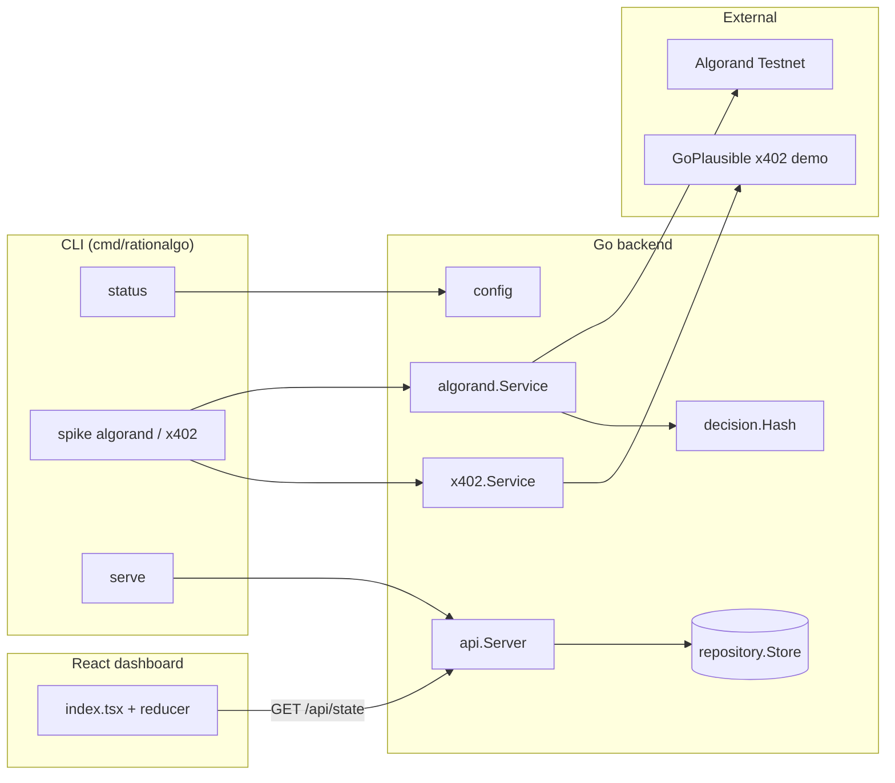
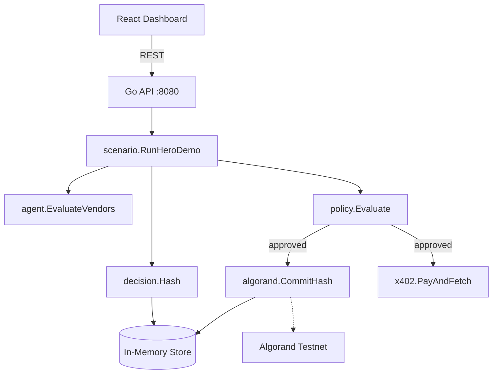

# RationAlgo

**Algorand-native policy & transparency layer for agentic commerce.**

Before an AI agent pays via x402, RationAlgo records *why* it chose to spend — vendor, alternatives, expected value, confidence, and policy checks. A hash of that decision is committed to Algorand Testnet. After payment, outcomes are compared to predictions so humans can audit agent spending.

Built for the [Algorand x402 Agentic Commerce Hackathon](https://luma.com/agentic-commerce-hack) (Infrastructure + EURQ tracks).

---

## Current status (Phases 0–1)

| Component | Status | Notes |
|-----------|--------|-------|
| Go build | ✅ | `go build ./cmd/rationalgo` |
| x402 probe (`spike x402`) | ✅ | HTTP 402 from GoPlausible `/avm/weather` |
| Algorand commit (`spike algorand`) | ⚠️ | Wallet address set; mnemonic must be **exactly 25 words** (Algorand SDK requirement) |
| HTTP API (`serve`) | ✅ | `GET /health`, `GET /api/state`, `POST /api/state/reset` |
| Dashboard → API | ✅ | Loads seed state from backend; shows **api live** when connected |
| Hero demo orchestration | 🔜 Phase 3 | Policy engine, live demo run, on-chain commits per decision |
| x402 paid flow | 🔜 Phase 2 | Sign payment and retry after 402 |

**Last validation:** x402 spike passes. Algorand spike blocked until `RATIONALGO_MNEMONIC` has all 25 words from Pera (Settings → Security → copy full passphrase for the same account as `RATIONALGO_WALLET_ADDRESS`).

---

## Repo layout

| Path | Purpose |
|------|---------|
| `backend/cmd/rationalgo/` | CLI entrypoint — `status`, `serve`, `spike` |
| `backend/internal/config/` | Load `.env`, validate wallet credentials |
| `backend/internal/models/` | Domain types (`Decision`, spike results) |
| `backend/internal/store/` | Seed data for the dashboard |
| `backend/internal/repository/` | Thread-safe in-memory state |
| `backend/internal/api/` | HTTP handlers (Phase 1) |
| `backend/internal/services/algorand/` | Testnet client + hash commitment |
| `backend/internal/services/x402/` | HTTP 402 probe (payment in Phase 2) |
| `backend/internal/services/decision/` | SHA-256 hashing of decision JSON |
| `backend/internal/util/` | Pera explorer URL helpers |
| `frontend/` | React audit dashboard |

---

## How the codebase works

This section is written to describe current state of the project. It describes **what exists today**, not the full hero demo (which lands in Phases 2–4).

### Big picture



Two entry paths share the same services:

1. **CLI spikes (Phase 0)** — prove integrations work in isolation before wiring the hero demo.
2. **HTTP API (Phase 1)** — serve dashboard state to the React UI over REST.

The hero demo flow (agent → policy → commit → pay → anomaly) is **not orchestrated yet**. The dashboard still runs a **client-side scripted demo** via `setTimeout`; the backend serves **static seed data** that mirrors that mock.

---

### Backend: CLI (`cmd/rationalgo/main.go`)

Thin dispatcher. Loads config, then routes by subcommand:

| Command | What it does |
|---------|----------------|
| *(no args)* / `status` | Print config summary and whether spikes are ready |
| `spike algorand` | Hash a sample decision JSON → commit on testnet |
| `spike x402` | Unpaid GET to GoPlausible → expect HTTP 402 |
| `spike all` | Both spikes in sequence |
| `serve` | Start HTTP API on `RATIONALGO_HTTP_ADDR` (default `:8080`) |

No business logic lives in `main.go`; it delegates to services and `api.Server`.

---

### Backend: configuration (`internal/config/`)

**`env.go`** — loads `backend/.env` via `godotenv` (looks for `.env` in cwd or `backend/.env`).

**`config.go`** — maps env vars to a `Config` struct. Key validations:

- `RATIONALGO_WALLET_ADDRESS` must be set (not the placeholder string).
- `RATIONALGO_MNEMONIC` must be non-empty and **exactly 25 space-separated words** (Algorand SDK requirement).
- On spike, the address derived from the mnemonic must match `RATIONALGO_WALLET_ADDRESS`.

Public AlgoNode testnet works with an empty `RATIONALGO_ALGOD_TOKEN`.

---

### Backend: decision hashing (`internal/services/decision/hash.go`)

```go
HashCanonicalJSON(v any) → SHA-256 hex string
```

Marshals any struct/map to JSON, hashes with SHA-256, returns hex digest. This is the **reasoning hash** that will eventually be committed on-chain for every agent purchase decision.

Used today by the Algorand spike with a sample payload:

```json
{"project":"RationAlgo","phase":0,"intent":"spike: weather data purchase reasoning","timestamp":"..."}
```

---

### Backend: Algorand integration (`internal/services/algorand/`)

**`client.go`** — low-level testnet operations:

1. Connect to Algod (`RATIONALGO_ALGOD_URL`).
2. Derive signing key from mnemonic; verify address matches config.
3. **`CommitHash(hash)`** — submits a **0-ALGO self-payment** with transaction note:
   ```
   RationAlgo:commit:<reasoning_hash>
   ```
4. Signs, broadcasts, waits for confirmation (4 rounds), returns `tx_id`.

This is intentionally minimal: no smart contract, no app call — just an on-chain timestamped note proving the hash existed before spend.

**`service.go`** — orchestrates the spike:

1. Fetch account balance.
2. Build sample decision map → `decision.HashCanonicalJSON`.
3. Call `client.CommitHash`.
4. Return `AlgorandSpikeResult` (address, balance, hash, tx_id, explorer URL).

---

### Backend: x402 integration (`internal/services/x402/service.go`)

**Phase 0 scope:** probe only, no payment.

1. `GET` to `RATIONALGO_X402_PROBE_URL` (default: `https://example.x402.goplausible.xyz/avm/weather`).
2. Without an `X-PAYMENT` header, the server responds **402 Payment Required**.
3. Reads `PAYMENT-REQUIRED` (or `X-PAYMENT-REQUIRED`) header containing payment requirements JSON.

**Phase 2** will parse that header, sign an Algorand payment (EURQ ASA), attach `X-PAYMENT`, and retry for the protected resource.

---

### Backend: HTTP API (`internal/api/server.go`)

Phase 1 REST layer over in-memory state:

| Method | Path | Handler |
|--------|------|---------|
| GET | `/health` | `{"status":"ok","phase":"1"}` |
| GET | `/api/state` | Full `AppState` JSON |
| POST | `/api/state/reset` | Reset store to seed data, return state |

CORS is enabled (`Access-Control-Allow-Origin: *`) so the Vite dev server can call the API from a different port.

**`internal/store/seed.go`** — hard-coded demo decisions/vendors/alerts matching the frontend mock.

**`internal/repository/store.go`** — thread-safe wrapper with `State()`, `Reset()`, `AddDecision()`, `UpdateDecision()` (the mutation methods are ready for Phase 3 but unused by HTTP handlers yet).

---

### Frontend: dashboard (`frontend/src/`)

**State model** — `lib/rationale/types.ts` defines `Decision`, `AppState`, etc. Mirrors backend `models/decision.go`.

**Initial data** — `lib/rationale/mock.ts` seeds 4 historical decisions (approved/blocked examples).

**Reducer** — `lib/rationale/reducer.ts` handles UI actions:

- `HYDRATE` — replace state from API response
- `ADD_DECISION`, `UPDATE_DECISION`, `SET_OUTCOME` — demo scenario steps
- `SPEND`, `ADJUST_TRUST`, `ADD_ALERT`, `SELECT`, `RESET`

**API client** — `lib/rationale/api.ts`:

- On mount, `index.tsx` calls `GET {VITE_API_URL}/api/state` (default `http://localhost:8080`).
- Success → `HYDRATE` + **api live** badge in top bar.
- Failure → falls back to local mock (no badge).

**Demo scenario** — `lib/rationale/demoScenario.ts` runs a ~7s scripted flow via `setTimeout`:

1. WeatherAPI purchase appears as PENDING → APPROVED
2. Outcome recorded (+23% predicted vs +25% actual)
3. MetricsHub.xyz blocked (price anomaly)

This is still **100% client-side**. The backend does not receive demo events yet.

**UI components** — `components/rationale/`:

- `DecisionFeed` / `DecisionCard` — scrollable audit log
- `DecisionDrawer` — full reasoning, alternatives, policy checks, on-chain hash
- `PolicyPanel` — daily limit, allow/block lists, alerts
- `VendorTrustPanel` — vendor scores

---

### Data flow today

**Spike path (Phase 0):**

```
CLI spike algorand
  → algorand.Service.RunSpike()
    → decision.HashCanonicalJSON(sample)
    → algorand.Client.CommitHash(hash)
      → 0-ALGO txn with note on Testnet
    → print tx_id + explorer link
```

**Dashboard path (Phase 1):**

```
browser loads /
  → fetch GET /api/state
  → repository.Store.State() (seed data)
  → reducer HYDRATE
  → render feed + panels

user clicks "run demo scenario"
  → demoScenario.ts timers
  → local reducer only (backend unchanged)
```

---

### What is not built yet

| Planned | Package / location | Hero demo step |
|---------|-------------------|----------------|
| Policy engine | `services/policy/` (TBD) | Evaluate allowlist, budget, anomaly |
| Agent vendor picker | `services/agent/` (TBD) | Compare WeatherAPI A/B/Free |
| x402 payment | extend `services/x402/` | EURQ pay after 402 |
| Hero orchestrator | `scenario/` or API handler | Wire all steps + persist to store |
| Live on-chain commits per decision | extend `algorand.Service` | Hash each real decision, not spike sample |

Target architecture (end state):



---

## Quick start

### Backend

```bash
cd backend
cp .env.example .env
# edit .env — see Environment variables below
go build -o bin/rationalgo ./cmd/rationalgo
go run ./cmd/rationalgo              # config status
go run ./cmd/rationalgo spike all    # integration spikes
go run ./cmd/rationalgo serve        # HTTP API
```

### Frontend

```bash
cd frontend
bun install
bun run dev
# optional: VITE_API_URL=http://localhost:8080
```

With `serve` running, the dashboard top bar shows **api live**.

---

## Phase 0 — Integration spikes

Edit `backend/.env`:

```env
RATIONALGO_WALLET_ADDRESS=<58-char Pera testnet address>
RATIONALGO_MNEMONIC=<25 words, space-separated, same account>
RATIONALGO_ALGOD_TOKEN=          # leave empty for public AlgoNode
```

Fund the account on the [Algorand Testnet dispenser](https://bank.testnet.algorand.network/) if balance is low.

```bash
go run ./cmd/rationalgo spike algorand   # testnet hash commitment
go run ./cmd/rationalgo spike x402       # GoPlausible 402 probe
```

**Exit criteria**

- [x] `spike x402` → HTTP 402 + `PAYMENT-REQUIRED` header
- [ ] `spike algorand` → real `tx_id` + [Pera Explorer](https://testnet.explorer.perawallet.app) link

**Troubleshooting**

| Error | Fix |
|-------|-----|
| `mnemonic must be 25 words` | Copy all 25 words from Pera (not 12/24-word BIP39 seeds) |
| `mnemonic address … does not match` | Mnemonic and wallet address must be from the **same** Pera account |
| `account info: …` / insufficient balance | Fund via testnet dispenser |
| x402 returns 404 | Use `/avm/weather` not `/api/json` (endpoint moved) |

---

## Phase 1 — HTTP API + dashboard wiring

```bash
go run ./cmd/rationalgo serve
curl http://localhost:8080/health
curl http://localhost:8080/api/state
```

**Exit criteria**

- [x] `/health` returns `{"status":"ok","phase":"1"}`
- [x] `/api/state` returns JSON with `decisions` array
- [x] Dashboard shows **api live** when backend is running

---

## Roadmap

| Phase | Deliverable |
|-------|-------------|
| **0** | Prove Algorand hash commit + x402 402 probe |
| **1** | HTTP API serves dashboard state; frontend hydrates from API |
| **2** | x402 paid flow (EURQ on Algorand testnet) |
| **3** | Policy engine + hero demo orchestration via API |
| **4** | On-chain commit + outcome tracking wired into live demo |

---

## Environment variables

| Variable | Required | Description |
|----------|----------|-------------|
| `RATIONALGO_WALLET_ADDRESS` | Yes (spikes) | 58-character Pera Testnet address |
| `RATIONALGO_MNEMONIC` | Yes (spikes) | 25-word Algorand passphrase (same account) |
| `RATIONALGO_ALGOD_TOKEN` | No | Empty for public AlgoNode testnet |
| `RATIONALGO_ALGOD_URL` | No | Default: `https://testnet-api.algonode.cloud` |
| `RATIONALGO_X402_PROBE_URL` | No | Default: `…/avm/weather` |
| `RATIONALGO_HTTP_ADDR` | No | Default: `:8080` |
| `VITE_API_URL` | No | Frontend API base (default: `http://localhost:8080`) |
| `VITE_USE_API` | No | Set to `false` to skip API and use local mock only |

Never commit `backend/.env`.

---

## Hackathon demo (hero flow — target)

1. Agent needs weather data → evaluates vendors
2. Decision Record generated with reasoning
3. Policy engine approves
4. Reasoning hash committed on Algorand
5. x402 payment in EURQ
6. Vendor price spikes 10×
7. Policy flags anomaly → purchase rejected
8. Dashboard shows audit trail + trust scores

Steps 1–3 and 6–8 have UI mock coverage. Steps 4–5 need Phases 2–3 backend work.

---

## License

Hackathon submission — MIT (TBD).
