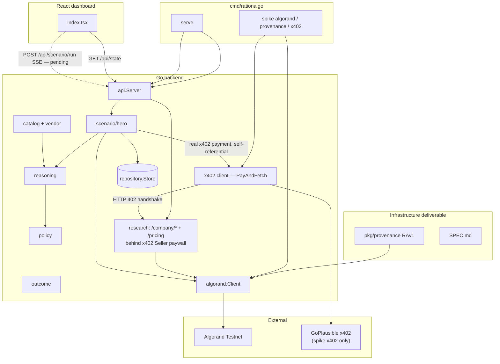

# RationAlgo

**Algorand-native policy & transparency layer for agentic commerce.**

Before an AI agent pays via x402, RationAlgo commits structured reasoning on Algorand — creating a tamper-evident audit trail. After payment, outcomes are compared to predictions so humans can trust agent spending decisions.

Built for the [Algorand x402 Agentic Commerce Hackathon](https://luma.com/agentic-commerce-hack) (Infrastructure + EURQ tracks).

**Infrastructure deliverable:** [`backend/pkg/provenance/`](backend/pkg/provenance/) — the **RAv1** note-field standard (`RAv1:` pre-payment, `RAv1out:` post-outcome). See [`SPEC.md`](backend/pkg/provenance/SPEC.md).

---

## Current status

| Component | Status | Notes |
|-----------|--------|-------|
| `pkg/provenance/` (RAv1) | ✅ | Encode/decode, tests, SPEC, standalone example |
| x402 probe (`spike x402`) | ✅ | HTTP 402 from GoPlausible `/avm/weather` |
| x402 pay (`spike x402 pay`) | ✅ | Real ASA payment via GoPlausible facilitator (testnet or mainnet) |
| Algorand legacy spike (`spike algorand`) | ⚠️ | Needs valid Pera **Algorand** passphrase + funded wallet |
| RAv1 spike (`spike provenance`) | ⚠️ | Same wallet requirement; commits `RAv1:` envelope |
| Vendor catalog | ✅ | `internal/catalog/` + `services/vendor/` — 10 priced `/company/*` research endpoints |
| x402 seller (`/company/*`, `/pricing`) | ✅ | Real on-chain ASA paywall — `services/x402.Seller` + `services/research/` |
| Reasoning / policy / outcome | ✅ | Hero uses deterministic per-purchase reasoning; `POST /api/decide` uses Anthropic when key is set |
| Hero orchestrator | ✅ | `scenario/hero.go` — budgeted multi-endpoint knapsack research (normal + anomaly) |
| HTTP API | ✅ | State, decisions, scenario SSE stream |
| Dashboard → API | ✅ | Hydrates from `GET /api/state`; demo still client-side |
| Real EURQ `PayAndFetch` | ✅ | GoPlausible x402 v2 — ASA transfer + facilitator settlement |
| Frontend → scenario SSE | 🔜 | Replace `demoScenario.ts` timers with backend stream |

---

## Hero demo

**Task:** *"Research Atlas Robotics GmbH within a €1.00 data budget — which paid sources are worth buying?"*

RationAlgo hosts its own **x402-protected company-research marketplace**: 10 priced
`/company/*` endpoints (basic info, industry, top products, reviews, competitors, news
sentiment, growth rate, revenue estimate, security incidents, legal issues — $0.01 to
$1.00 each; see [Company-research marketplace](#company-research-marketplace-x402-seller)).
The agent runs a **0/1 knapsack** (`value = importance × confidence`, `score = value / price`)
to pick the best-value subset that fits the budget, then buys them one at a time — each
purchase running the full reasoning → policy → on-chain provenance commit → real x402
payment → outcome-verification pipeline, producing its own audited `DecisionRecord`.

| Flow | What happens |
|------|----------------|
| **Normal** | Knapsack orders endpoints by value/price → each approved purchase: RAv1 commit on Algorand → real on-chain x402 ASA payment to RationAlgo's own seller → confidence-vs-expectation outcome check → RAv1out commit → final `research.summary` |
| **Anomaly** | The first selected endpoint's price is injected at 10× → policy blocks **that** purchase (alert fires, no Algorand tx, no x402 call) → the agent keeps buying the rest of the plan with its remaining budget |

Trigger via API (backend ready; frontend wiring pending):

```bash
curl -N -X POST "http://localhost:8080/api/scenario/run"
curl -N -X POST "http://localhost:8080/api/scenario/run?scenario=anomaly"
```

---

## Repo layout

| Path | Purpose |
|------|---------|
| `backend/pkg/provenance/` | **RAv1 standard** — importable, stdlib-only |
| `backend/cmd/rationalgo/` | CLI — `status`, `serve`, `spike` |
| `backend/internal/catalog/` | Vendor registry — derives RationAlgo's own `/company/*` x402 endpoints from `services/research` pricing |
| `backend/internal/scenario/` | Hero demo orchestrator (budgeted multi-endpoint research) + SSE events |
| `backend/internal/models/` | Unified types in `decision.go` — `DecisionRecord`, `VendorOption`, `PolicyResult`, dashboard `Decision` |
| `backend/internal/services/` | `algorand`, `x402` (client + seller), `decision`, `vendor`, `reasoning`, `policy`, `outcome`, `research` (company-research data + paywalled handlers) |
| `backend/internal/api/` | HTTP handlers (stdlib `net/http`) |
| `backend/internal/repository/` | Thread-safe in-memory store |
| `backend/internal/store/` | Dashboard seed data |
| `backend/internal/util/` | Explorer URLs, 24/25-word mnemonic normalization |
| `frontend/` | React audit dashboard |

---

## Architecture



The hero demo's x402 payments are now **self-referential**: the agent pays RationAlgo's
own `/company/*` endpoints, hosted by the same backend. `GoPlausible` remains only as the
external target for the standalone `spike x402` / `spike x402 pay` integration spikes.

### Provenance on-chain (judge story)

Every approved spend writes **two** Algorand transactions:

1. **Pre-payment** — note: `RAv1:<base64url(JSON)>` (reasoning before spend)
2. **Post-outcome** — note: `RAv1out:<base64url(JSON)>` (links actual result to original tx)

Query via Algorand Indexer: `note-prefix=RAv1:` — no app database required.

Legacy Phase 0 spike still uses `RationAlgo:commit:<hash>` via `CommitHash`; new code uses `CommitProvenance` / `CommitOutcome`.

---

## Quick start

### Backend

```bash
cd backend
cp .env.example .env
# edit .env — wallet address + mnemonic (see below)
go build -o bin/rationalgo ./cmd/rationalgo
go run ./cmd/rationalgo              # config status
go run ./cmd/rationalgo spike all    # integration spikes
go run ./cmd/rationalgo serve        # HTTP API :8080 (Ctrl+C to stop)
```

Stop the server with **Ctrl+C** before starting another instance. If `:8080` is already in use, a previous `rationalgo.exe` may still be running — see [Troubleshooting](#troubleshooting).

### Provenance package (no wallet needed)

```bash
cd backend
go test ./pkg/provenance/...
go run ./pkg/provenance/example
```

### Frontend

```bash
cd frontend
bun install
bun run dev
```

With `serve` running, the dashboard top bar shows **api live**.

---

## CLI commands

| Command | Purpose |
|---------|---------|
| `go run ./cmd/rationalgo` | Config status + spike readiness |
| `go run ./cmd/rationalgo serve` | Start HTTP API |
| `go run ./cmd/rationalgo spike algorand` | Legacy hash commit (`RationAlgo:commit:…`) |
| `go run ./cmd/rationalgo spike provenance` | RAv1 envelope commit on testnet |
| `go run ./cmd/rationalgo spike x402` | Unpaid 402 probe |
| `go run ./cmd/rationalgo spike x402 pay` | Real payment + fetch via GoPlausible facilitator |
| `go run ./cmd/rationalgo spike all` | All spikes in sequence |

---

## HTTP API

| Method | Path | Purpose |
|--------|------|---------|
| GET | `/health` | Liveness (`{"status":"ok","phase":"2"}`) |
| GET | `/api/state` | Full dashboard state |
| GET | `/api/decisions` | Decision feed only |
| POST | `/api/state/reset` | Reset to seed data |
| POST | `/api/scenario/run` | SSE stream — normal hero demo |
| POST | `/api/scenario/run?scenario=anomaly` | SSE stream — blocked purchase demo |
| POST | `/api/decide` | LLM reasoning pipeline — returns `DecisionRecord` (requires `RATIONALGO_ANTHROPIC_KEY`) |
| GET | `/pricing` | Unprotected x402 pricing discovery — `{"pricing": [...]}` |
| GET | `/company/*` | 10 x402-protected company-research endpoints (see [Company-research marketplace](#company-research-marketplace-x402-seller)) |

CORS enabled for local frontend dev (`Access-Control-Allow-Origin: *`).

---

## Company-research marketplace (x402 seller)

RationAlgo isn't just an x402 **buyer** — it hosts a real x402 **seller**. Ten priced,
on-chain-paywalled `/company/*` endpoints plus an unprotected `/pricing` discovery route
are served by [`internal/services/research/`](backend/internal/services/research/) and
protected by [`internal/services/x402.Seller`](backend/internal/services/x402/seller.go).

| Path | Price (USD) | Returns |
|------|-------------|---------|
| `/pricing` | free | Full catalog with `price_usd` / `price_microalgo` |
| `/company/basic-info?company=...` | $0.01 | Jurisdiction, company number, incorporation date |
| `/company/industry?company=...` | $0.01 | Industry tags + NAICS code |
| `/company/top-products?company=...` | $0.02 | Top product list |
| `/company/reviews-summary?company=...` | $0.10 | Average rating, sample count, highlights |
| `/company/competitors?company=...` | $0.10 | Competitor names |
| `/company/news-sentiment?company=...` | $0.15 | Sentiment score + sample headlines |
| `/company/growth-rate?company=...` | $0.20 | YoY growth estimate |
| `/company/revenue-estimate?company=...` | $0.50 | Revenue range |
| `/company/security-incidents?company=...` | $0.50 | Security incident history |
| `/company/legal-issues?company=...` | $1.00 | Legal issue history |

Every `/company/*` response is `{"data": ..., "metadata": {...}, "confidence": 0.0-1.0}`,
backed by **deterministic mock data** (seeded from the company name — same input always
produces the same output, "Determinism for demo") plus provenance fields (`source: "mock"`,
`retrieved_at`).

**Real on-chain x402 handshake:** an unpaid request gets `402 Payment Required` with a
`PAYMENT-REQUIRED` header describing an ASA transfer (testnet USDC `10458941` by default —
override with `RATIONALGO_SETTLEMENT_ASSET_ID`); the client signs and resubmits with a
`PAYMENT-SIGNATURE` header, the seller decodes the signed transaction, verifies it on-chain
(asset id, receiver, amount, signature present, not replayed), broadcasts + confirms it via
`algorand.Client.SubmitSignedTxn`, and only then serves the data with a `PAYMENT-RESPONSE`
header.

**Demo simplification:** the seller and the buying agent share the **same configured
wallet** (`RATIONALGO_WALLET_ADDRESS` / `RATIONALGO_MNEMONIC`) — a self-payment, just like
the existing `CommitHash` provenance pattern. In production, buyer and seller would be
different parties with separate wallets.

---

## Wallet setup

Edit `backend/.env`:

```env
RATIONALGO_WALLET_ADDRESS=<58-char Pera testnet address>
RATIONALGO_MNEMONIC=<24 or 25 words, space-separated, same account>
RATIONALGO_ALGOD_TOKEN=          # leave empty for public AlgoNode
```

**Mnemonic notes:**

- Algorand uses **25 words**; word 25 is a checksum derived from the first 24.
- Pera often displays **24 words** — RationAlgo auto-derives the checksum (`internal/util/mnemonic.go`).
- The passphrase must be the **Algorand recovery phrase** from Pera → Settings → Security (not a BIP-39 seed from another chain).
- The address derived from the mnemonic must match `RATIONALGO_WALLET_ADDRESS`.

Fund via the [Algorand Testnet dispenser](https://bank.testnet.algorand.network/) if balance is low.

### Troubleshooting

| Error | Fix |
|-------|-----|
| `mnemonic must be 24 or 25 Algorand words` | Paste the full Pera recovery phrase |
| `not a valid Algorand recovery phrase` | Wrong words or non-Algorand seed — re-export from Pera |
| `mnemonic address … does not match` | Mnemonic and address must be the **same** account |
| `account info: …` / insufficient balance | Fund via testnet dispenser |
| x402 returns 404 | Use `/avm/weather` not `/api/json` |
| x402 pay fails: wallet required | Set `RATIONALGO_WALLET_ADDRESS` + `RATIONALGO_MNEMONIC` in `.env` |
| x402 pay fails: insufficient ASA | Opt-in + fund testnet USDC ASA `10458941` (0.001 = 1000 units). Mainnet USDC is ASA `31566704` — point `RATIONALGO_ALGOD_URL` at mainnet |
| `listen tcp :8080: bind: … address already in use` | Stop the old server (**Ctrl+C**) or kill the stale process: `netstat -ano \| findstr :8080` then `taskkill /PID <pid> /F`. Or set `RATIONALGO_HTTP_ADDR=:8081` in `.env`. |
| `RATIONALGO_ANTHROPIC_KEY not set` | Harmless for hero demo and spikes; required only for `POST /api/decide` |

---

## How the codebase works

### `pkg/provenance/` — RAv1 standard

Stdlib-only package. `Encode` / `Decode` for pre-payment envelopes; `EncodeOutcome` / `DecodeOutcome` for post-outcome. Used by `algorand.Client.CommitProvenance` and `CommitOutcome`.

### `internal/catalog/` — vendor registry

Derives its 10 entries directly from `services/research.Pricing` — RationAlgo's own
x402-protected `/company/*` company-research endpoints (basic info, industry, top
products, reviews, competitors, news sentiment, growth rate, revenue estimate, security
incidents, legal issues; $0.01–$1.00, confidence 0.55–0.92). `services/vendor/` adapts
catalog entries to `models.VendorOption`, anchors each `EndpointURL` at
`cfg.PublicBaseURL()`, and supplies flat price history for anomaly detection.

### `internal/scenario/hero.go` — orchestrator

Runs a **budgeted multi-endpoint research flow** with 600ms delays between SSE events.
A 0/1 knapsack (`services/research.Select`) first picks the best-value subset of
`/company/*` endpoints for the demo budget; the agent then buys them one at a time:

```
agent.thinking → [per selected endpoint, in value/price order]
  decision.pending → [policy: live remaining budget + allowlist + anomaly check]
    → approved: decision.committed → payment.sent → decision.outcome → store
    → blocked:  decision.blocked → alert.fired → store (continue with the rest of the plan)
→ research.summary
```

### Services (stubs → real logic)

| Service | Role |
|---------|------|
| `reasoning` | `GenerateResearchDecision` — assembles a `DecisionRecord` per knapsack-selected purchase (deterministic, no API key). `GenerateDecision` — Anthropic LLM for `POST /api/decide` |
| `policy` | Budget, allowlist, 5× price anomaly (`services/policy/service.go`) |
| `outcome` | Verifies the confidence a purchased endpoint actually returned vs. what the agent expected to get for the price |
| `research` | RationAlgo's own company-research data + handlers — 10 priced endpoints, deterministic mock payloads, `/pricing` discovery, knapsack selection (`services/research/`) |
| `x402` | Client: `RunProbe` + real `PayAndFetch` (402 → sign → settle → 200). Seller: `Seller.Protect` — verifies + settles on-chain ASA payments and paywalls `/company/*` |
| `algorand` | `CommitHash`, `CommitProvenance`, `CommitOutcome`, `SubmitSignedTxn` — on-chain commits and settlement via the same wallet |

### Frontend

- Loads seed/historical state from `GET /api/state` on mount.
- **Run demo scenario** still uses client-side `demoScenario.ts` timers — wire to `POST /api/scenario/run` SSE next.

---

## Roadmap

| Milestone | Deliverable | Status |
|-----------|-------------|--------|
| **0** | Algorand + x402 integration spikes | ✅ probe; ⚠️ on-chain needs valid wallet |
| **1** | HTTP API + dashboard hydration | ✅ |
| **Infra** | `pkg/provenance/` RAv1 + SPEC | ✅ |
| **2** | Catalog, services, hero orchestrator, SSE API | ✅ |
| **3** | Real EURQ `PayAndFetch` | ✅ |
| **4** | Frontend scenario SSE + live demo UI | 🔜 |

---

## Environment variables

| Variable | Required | Description |
|----------|----------|-------------|
| `RATIONALGO_WALLET_ADDRESS` | Yes (spikes) | 58-character Pera Testnet address |
| `RATIONALGO_MNEMONIC` | Yes (spikes) | 24- or 25-word Algorand passphrase (same account) |
| `RATIONALGO_ALGOD_TOKEN` | No | Empty for public AlgoNode testnet |
| `RATIONALGO_ALGOD_URL` | No | Default: `https://testnet-api.algonode.cloud` |
| `RATIONALGO_X402_PROBE_URL` | No | Default: `…/avm/weather` (used by `spike x402`, not the hero demo) |
| `RATIONALGO_SETTLEMENT_ASSET_ID` | No | ASA the `/company/*` x402 seller charges in. Default: testnet USDC `10458941` |
| `RATIONALGO_HTTP_ADDR` | No | Default: `:8080` — also used to build the seller's self-referential `EndpointURL`s (`cfg.PublicBaseURL()`) |
| `RATIONALGO_ANTHROPIC_KEY` | No | Anthropic API key for `POST /api/decide` (hero demo works without it) |
| `VITE_API_URL` | No | Frontend API base (default: `http://localhost:8080`) |
| `VITE_USE_API` | No | Set to `false` to skip API and use local mock only |

Never commit `backend/.env`.

---

## License

Hackathon submission — MIT (TBD).
