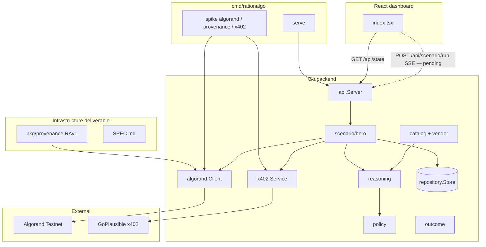

# RationAlgo

**Algorand-native policy & transparency layer for agentic commerce.**

Before an AI agent pays via x402, RationAlgo commits structured reasoning on Algorand — creating a tamper-evident audit trail. After payment, outcomes are compared to predictions so humans can trust agent spending decisions.

Built for the [Algorand x402 Agentic Commerce Hackathon](https://luma.com/agentic-commerce-hack) (Infrastructure + EURQ tracks).

**Infrastructure deliverable:** [`backend/pkg/provenance/`](backend/pkg/provenance/) — the **RAv1** note-field standard (`RAv1:` pre-payment, `RAv1out:` post-outcome). See [`SPEC.md`](backend/pkg/provenance/SPEC.md).

---

## Current status

| Component | Status | Notes |
|-----------|--------|-------|
| `pkg/provenance/` (RAv1) | ✅ | Encode/decode, tests, SPEC, standalone example |
| x402 probe (`spike x402`) | ✅ | HTTP 402 from GoPlausible `/avm/weather` |
| x402 pay stub (`spike x402 pay`) | ✅ | Probe + demo JSON (real EURQ payment next) |
| Algorand legacy spike (`spike algorand`) | ⚠️ | Needs valid Pera **Algorand** passphrase + funded wallet |
| RAv1 spike (`spike provenance`) | ⚠️ | Same wallet requirement; commits `RAv1:` envelope |
| Vendor catalog | ✅ | `internal/catalog/` + `services/vendor/` adapter |
| Reasoning / policy / outcome | ✅ | Stub services wired into hero orchestrator |
| Hero orchestrator | ✅ | `scenario/hero.go` — normal + anomaly flows |
| HTTP API | ✅ | State, decisions, scenario SSE stream |
| Dashboard → API | ✅ | Hydrates from `GET /api/state`; demo still client-side |
| Real EURQ `PayAndFetch` | 🔜 | Parse `PAYMENT-REQUIRED`, sign ASA, retry |
| Frontend → scenario SSE | 🔜 | Replace `demoScenario.ts` timers with backend stream |

---

## Hero demo (target)

**Task:** *"Should drone deliveries operate in Frankfurt in the next 2 hours?"*

| Flow | What happens |
|------|----------------|
| **Normal** | GoPlausible paid weather wins over OpenMeteo → RAv1 commit on Algorand → x402 payment → outcome verified → RAv1out commit |
| **Anomaly** | Vendor price injected at 10× → policy blocks → **no** Algorand tx, **no** x402 call → alert fires |

Trigger via API (backend ready; frontend wiring pending):

```bash
curl -N -X POST "http://localhost:8080/api/scenario/run"
curl -N -X POST "http://localhost:8080/api/scenario/run?scenario=anomaly"
```

---

## Repo layout

| Path | Purpose |
|------|---------|
| `backend/pkg/provenance/` | **RAv1 standard** — importable, stdlib-only |
| `backend/cmd/rationalgo/` | CLI — `status`, `serve`, `spike` |
| `backend/internal/catalog/` | Curated vendor registry (MVP source of truth) |
| `backend/internal/scenario/` | Hero demo orchestrator + SSE events |
| `backend/internal/models/` | `DecisionRecord`, `VendorOption`, `PolicyResult`, dashboard types |
| `backend/internal/services/` | `algorand`, `x402`, `decision`, `vendor`, `reasoning`, `policy`, `outcome` |
| `backend/internal/api/` | HTTP handlers (stdlib `net/http`) |
| `backend/internal/repository/` | Thread-safe in-memory store |
| `backend/internal/store/` | Dashboard seed data |
| `backend/internal/util/` | Explorer URLs, 24/25-word mnemonic normalization |
| `frontend/` | React audit dashboard |

---

## Architecture



### Provenance on-chain (judge story)

Every approved spend writes **two** Algorand transactions:

1. **Pre-payment** — note: `RAv1:<base64url(JSON)>` (reasoning before spend)
2. **Post-outcome** — note: `RAv1out:<base64url(JSON)>` (links actual result to original tx)

Query via Algorand Indexer: `note-prefix=RAv1:` — no app database required.

Legacy Phase 0 spike still uses `RationAlgo:commit:<hash>` via `CommitHash`; new code uses `CommitProvenance` / `CommitOutcome`.

---

## Quick start

### Backend

```bash
cd backend
cp .env.example .env
# edit .env — wallet address + mnemonic (see below)
go build -o bin/rationalgo ./cmd/rationalgo
go run ./cmd/rationalgo              # config status
go run ./cmd/rationalgo spike all    # integration spikes
go run ./cmd/rationalgo serve        # HTTP API :8080
```

### Provenance package (no wallet needed)

```bash
cd backend
go test ./pkg/provenance/...
go run ./pkg/provenance/example
```

### Frontend

```bash
cd frontend
bun install
bun run dev
```

With `serve` running, the dashboard top bar shows **api live**.

---

## CLI commands

| Command | Purpose |
|---------|---------|
| `go run ./cmd/rationalgo` | Config status + spike readiness |
| `go run ./cmd/rationalgo serve` | Start HTTP API |
| `go run ./cmd/rationalgo spike algorand` | Legacy hash commit (`RationAlgo:commit:…`) |
| `go run ./cmd/rationalgo spike provenance` | RAv1 envelope commit on testnet |
| `go run ./cmd/rationalgo spike x402` | Unpaid 402 probe |
| `go run ./cmd/rationalgo spike x402 pay` | Probe + stub fetch (real EURQ next) |
| `go run ./cmd/rationalgo spike all` | All spikes in sequence |

---

## HTTP API

| Method | Path | Purpose |
|--------|------|---------|
| GET | `/health` | Liveness (`{"status":"ok","phase":"2"}`) |
| GET | `/api/state` | Full dashboard state |
| GET | `/api/decisions` | Decision feed only |
| POST | `/api/state/reset` | Reset to seed data |
| POST | `/api/scenario/run` | SSE stream — normal hero demo |
| POST | `/api/scenario/run?scenario=anomaly` | SSE stream — blocked purchase demo |

CORS enabled for local frontend dev (`Access-Control-Allow-Origin: *`).

---

## Wallet setup

Edit `backend/.env`:

```env
RATIONALGO_WALLET_ADDRESS=<58-char Pera testnet address>
RATIONALGO_MNEMONIC=<24 or 25 words, space-separated, same account>
RATIONALGO_ALGOD_TOKEN=          # leave empty for public AlgoNode
```

**Mnemonic notes:**

- Algorand uses **25 words**; word 25 is a checksum derived from the first 24.
- Pera often displays **24 words** — RationAlgo auto-derives the checksum (`internal/util/mnemonic.go`).
- The passphrase must be the **Algorand recovery phrase** from Pera → Settings → Security (not a BIP-39 seed from another chain).
- The address derived from the mnemonic must match `RATIONALGO_WALLET_ADDRESS`.

Fund via the [Algorand Testnet dispenser](https://bank.testnet.algorand.network/) if balance is low.

### Troubleshooting

| Error | Fix |
|-------|-----|
| `mnemonic must be 24 or 25 Algorand words` | Paste the full Pera recovery phrase |
| `not a valid Algorand recovery phrase` | Wrong words or non-Algorand seed — re-export from Pera |
| `mnemonic address … does not match` | Mnemonic and address must be the **same** account |
| `account info: …` / insufficient balance | Fund via testnet dispenser |
| x402 returns 404 | Use `/avm/weather` not `/api/json` |

---

## How the codebase works

### `pkg/provenance/` — RAv1 standard

Stdlib-only package. `Encode` / `Decode` for pre-payment envelopes; `EncodeOutcome` / `DecodeOutcome` for post-outcome. Used by `algorand.Client.CommitProvenance` and `CommitOutcome`.

### `internal/catalog/` — vendor registry

Hard-coded MVP catalog (`WeatherPro`, `GoPlausible Weather`, `OpenMeteo`, routing/fuel/traffic vendors). `services/vendor/` adapts catalog entries to `models.VendorOption` and supplies price history for anomaly detection.

### `internal/scenario/hero.go` — orchestrator

Runs normal or anomaly demo with 600ms delays between SSE events:

```
agent.thinking → decision.pending → [policy]
  → approved: decision.committed → payment.sent → decision.outcome → store
  → blocked:  decision.blocked → alert.fired → store (no chain, no x402)
```

### Services (stubs → real logic)

| Service | Role |
|---------|------|
| `reasoning` | Picks best vendor for Frankfurt weather task; builds `DecisionRecord` |
| `policy` | Budget, allowlist, 5× price anomaly |
| `outcome` | Verifies paid forecast vs simulated OpenMeteo ground truth |
| `x402` | `RunProbe` + `PayAndFetch` stub (real EURQ signing next) |
| `algorand` | `CommitHash`, `CommitProvenance`, `CommitOutcome` via 0-ALGO self-payments |

### Frontend

- Loads seed/historical state from `GET /api/state` on mount.
- **Run demo scenario** still uses client-side `demoScenario.ts` timers — wire to `POST /api/scenario/run` SSE next.

---

## Roadmap

| Milestone | Deliverable | Status |
|-----------|-------------|--------|
| **0** | Algorand + x402 integration spikes | ✅ probe; ⚠️ on-chain needs valid wallet |
| **1** | HTTP API + dashboard hydration | ✅ |
| **Infra** | `pkg/provenance/` RAv1 + SPEC | ✅ |
| **2** | Catalog, services, hero orchestrator, SSE API | ✅ |
| **3** | Real EURQ `PayAndFetch` | 🔜 |
| **4** | Frontend scenario SSE + live demo UI | 🔜 |

---

## Environment variables

| Variable | Required | Description |
|----------|----------|-------------|
| `RATIONALGO_WALLET_ADDRESS` | Yes (spikes) | 58-character Pera Testnet address |
| `RATIONALGO_MNEMONIC` | Yes (spikes) | 24- or 25-word Algorand passphrase (same account) |
| `RATIONALGO_ALGOD_TOKEN` | No | Empty for public AlgoNode testnet |
| `RATIONALGO_ALGOD_URL` | No | Default: `https://testnet-api.algonode.cloud` |
| `RATIONALGO_X402_PROBE_URL` | No | Default: `…/avm/weather` |
| `RATIONALGO_HTTP_ADDR` | No | Default: `:8080` |
| `VITE_API_URL` | No | Frontend API base (default: `http://localhost:8080`) |
| `VITE_USE_API` | No | Set to `false` to skip API and use local mock only |

Never commit `backend/.env`.

---

## License

Hackathon submission — MIT (TBD).
